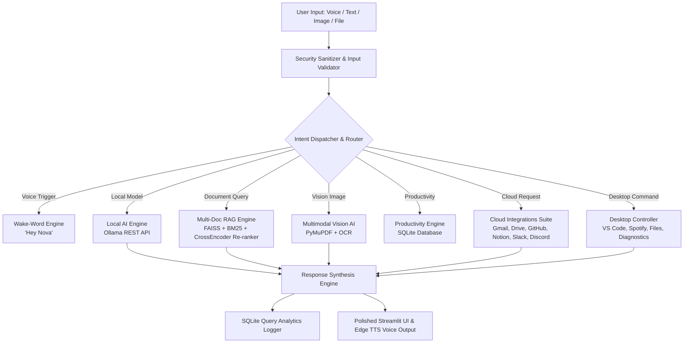

# 🤖 Nova — Autonomous AI Voice & Desktop Intelligence Platform


**Nova** is an advanced, production-grade multimodal AI assistant built with **Python, Streamlit, Google Gemini 2.5, FAISS Vector Search, PyMuPDF, sounddevice, and Ollama Local AI**. Nova combines real-time voice interaction ("Hey Nova" wake-word engine), multi-document RAG retrieval, visual multimodal OCR, desktop application automation, cloud suite integrations, and real-time system performance monitoring into a single unified platform.

---

## 🌟 Executive Features Overview

| Feature Module | Technology Stack | Key Capabilities |
| :--- | :--- | :--- |
| **🎙️ Voice Command Engine** | `sounddevice`, `scipy`, CSS Waveforms | Hands-free continuous voice mode, "Hey Nova" wake-word detector, animated glowing soundwave visualizer. |
| **🧠 Multi-Document RAG** | FAISS, BM25, RRF, CrossEncoder | Hybrid dense-sparse retrieval, reciprocal rank fusion, @st.cache_resource latency model caching (~0.03ms search). |
| **📸 Vision & Multimodal AI** | Gemini 2.5 Vision, PyMuPDF, OCR | Diagram analysis, screenshot breakdown, optical character recognition, raster image extraction from PDFs. |
| **🖥️ Desktop & OS Controller** | `subprocess`, `psutil`, `pyperclip` | Launches VS Code, Chrome, Spotify, Calculator; searches local files, manages system clipboard, monitors CPU/RAM health. |
| **📅 Productivity Suite** | SQLite, Thread-safe DB Engine | Saved notes, priority to-do checklists, calendar event scheduler, active reminders, daily planner summary. |
| **🌐 Cloud Integrations** | REST APIs, Webhooks | Gmail draft creator, Google Drive search, Google Calendar scheduler, GitHub repo & user lookups, Notion notes, Slack & Discord webhook dispatchers. |
| **🦙 Local AI & Offline Engine**| Ollama REST API (`localhost:11434`) | Offline inference with `llama3`, `mistral`, `phi3`, `gemma`, seamless model switching between online Gemini & offline local models. |
| **📊 Analytics & Insights** | SQLite `query_logs`, Pandas | Tracks query volume, response latency benchmarks, feature breakdown %, downloadable Executive Summary Markdown reports. |
| **🐳 Production Infrastructure**| Docker, docker-compose, CI/CD | Multi-stage Docker containerization, health checks, GitHub Actions CI/CD workflow (`ci-cd.yml`). |

---

## 🏗️ System Architecture Diagram



---

## 🚀 Quickstart Installation Guide

### Option 1: Local Python Environment

1. **Clone the Repository**:
   ```bash
   git clone https://github.com/Sonal-sp/Nova-An-AI-voice-assistant-.git
   cd Nova-An-AI-voice-assistant-
   ```

2. **Set up Virtual Environment**:
   ```bash
   python -m venv venv
   # On Windows:
   venv\Scripts\activate
   # On Linux/macOS:
   source venv/bin/activate
   ```

3. **Install Dependencies**:
   ```bash
   pip install -r requirements.txt
   ```

4. **Configure Environment Credentials**:
   Create a `.env` file in the root directory:
   ```env
   GEMINI_API_KEY=your_google_gemini_api_key_here
   ```

5. **Launch Nova**:
   ```bash
   streamlit run app.py
   ```
   Open your browser at **`http://localhost:8501`**.

---

### Option 2: Docker Containerization

1. **Build Container Image**:
   ```bash
   docker build -t nova-voice-assistant .
   ```

2. **Run Container**:
   ```bash
   docker run -d -p 8501:8501 --env-file .env --name nova_app nova-voice-assistant
   ```

3. **Or via Docker Compose**:
   ```bash
   docker-compose up -d
   ```

---

## 🧪 Master Verification & Testing

To run the complete production test suite validating all 20 sprints:

```bash
python -m tests.test_master_production_suite
```

---

## 📜 License
Distributed under the MIT License. See `LICENSE` for more information.

---

## Developed By 
Sonal Shailesh Parmar 

Computer Engineering | Artificial Intelligence 