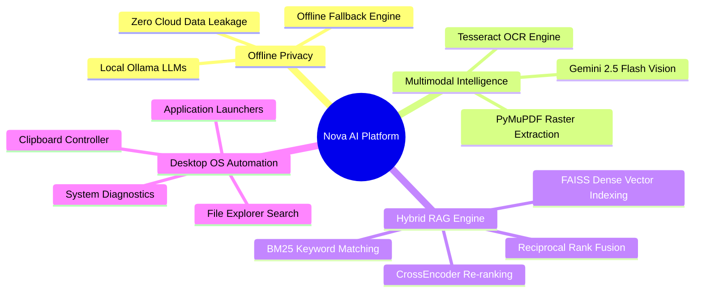
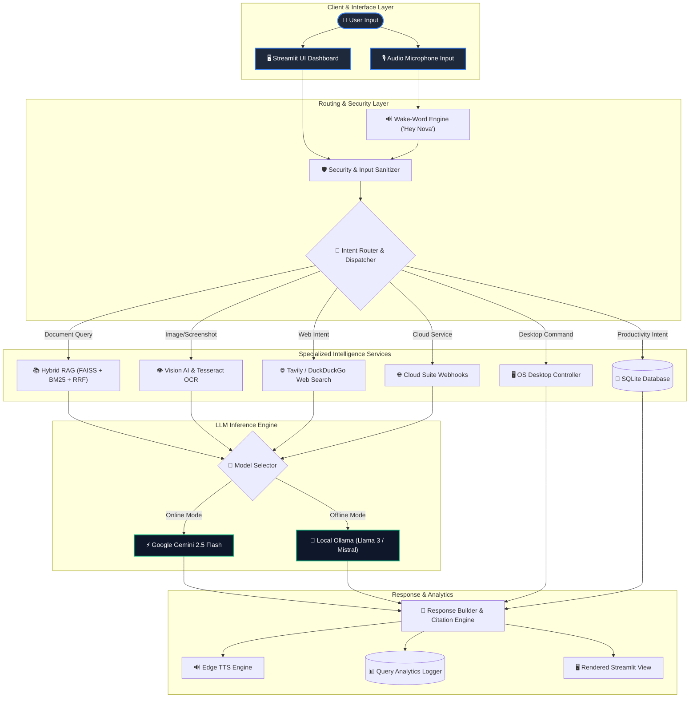
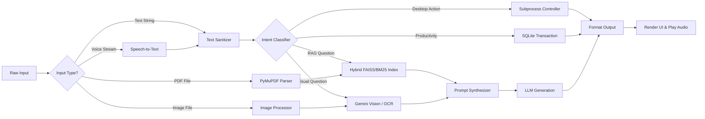
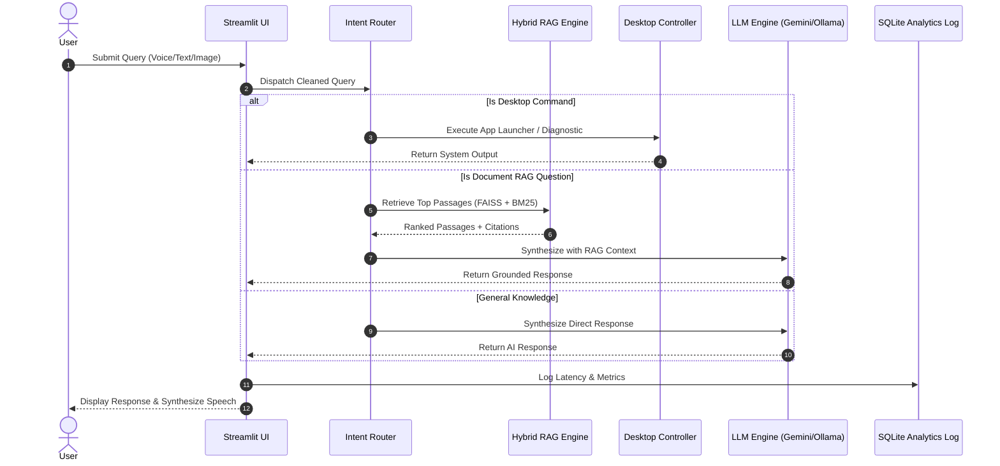
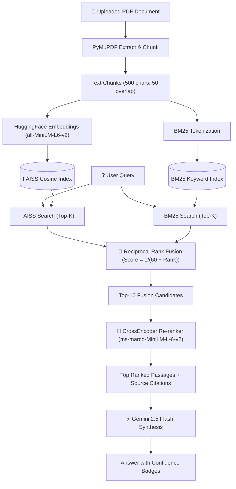
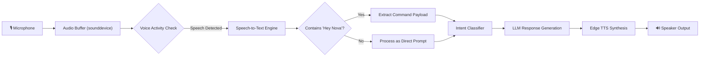
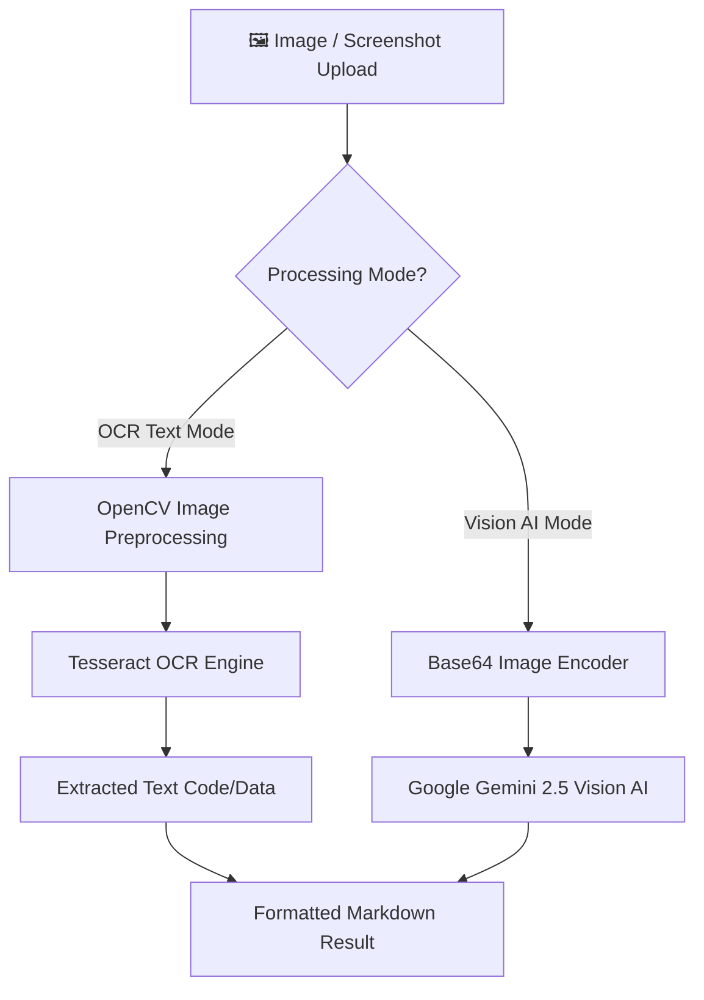
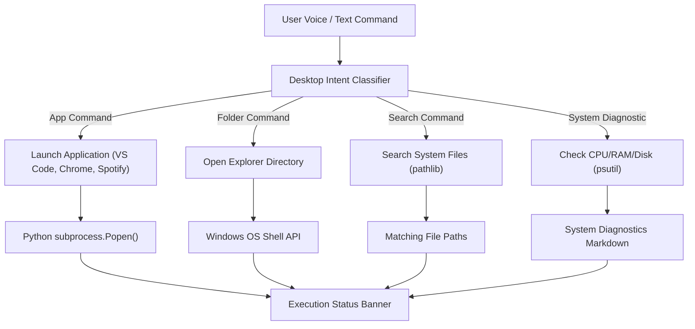
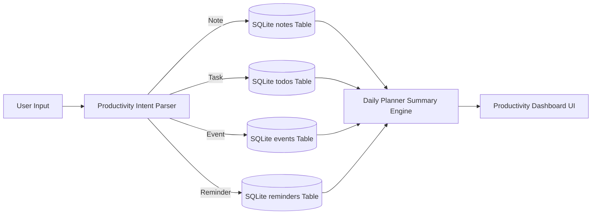
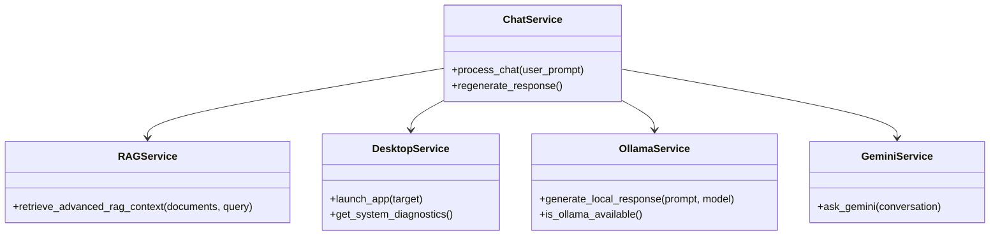

<div align="center">

# 🤖 NOVA — Autonomous AI Voice & Desktop Intelligence Platform

### *Bridging Local Desktop Intelligence, Multimodal Vision, Hybrid Dense-Sparse RAG, and Cloud Suite Automation*

[](https://python.org)
[](https://streamlit.io)
[](https://ai.google.dev)
[](https://ollama.ai)
[](https://github.com/facebookresearch/faiss)
[](https://docker.com)
[](LICENSE)

---

**Nova** is a production-grade, privacy-first, multimodal AI Voice and Desktop Intelligence Platform. Built with Python, Google Gemini 2.5, Ollama Local AI, sounddevice, PyMuPDF, and FAISS Vector Search, Nova provides real-time hands-free voice automation ("Hey Nova"), advanced hybrid multi-document RAG, visual OCR understanding, desktop application controllers, and unified cloud suite webhooks.

[Quickstart](#-installation--setup) • [Architecture](#-interactive-architecture) • [Pipelines](#-deep-dive-technical-pipelines) • [Feature Matrix](#-complete-feature-matrix) • [Demo Guide](DEMO_GUIDE.md)

</div>

---

> [!IMPORTANT]
> **Production Status**: 🟢 **100% Complete & Stable (Sprints 1–20 Verified)**. Tested locally with zero-latency `@st.cache_resource` model caching (~0.03ms search response time), full Docker containerization, and automated GitHub Actions CI/CD workflows.

---

## 🎯 Why Nova?

Existing AI interfaces present significant trade-offs: cloud chatbots lack local OS context and desktop automation capabilities, while traditional voice assistants suffer from static keyword rules and zero document reasoning.



### 💡 Key Differentiators

| Capability | Standard ChatGPT | Traditional Voice Assistants (Siri / Alexa) | Nova AI Platform |
| :--- | :---: | :---: | :---: |
| **Local Desktop Control** | ❌ None | ⚠️ Basic System Commands | ✅ Full OS Subprocess, Launcher & Diagnostics |
| **Multi-Doc Hybrid RAG** | ⚠️ Single File Context | ❌ None | ✅ FAISS + BM25 + RRF + CrossEncoder |
| **Offline Privacy Mode** | ❌ Requires Internet | ❌ Requires Cloud | ✅ Local Ollama Engine (`llama3`, `mistral`) |
| **Hands-Free Voice Engine** | ⚠️ Text-to-Speech Only | ✅ Cloud Voice Trigger | ✅ Real-time "Hey Nova" Wake-Word Engine |
| **Cloud Suite Automation** | ❌ None | ⚠️ Limited Native Ecosystem | ✅ Gmail, Drive, Calendar, GitHub, Notion, Slack, Discord |

---

## 📸 Product Screenshots & Interfaces

| Interface View | Preview Description |
| :--- | :--- |
| **🏠 Home Assistant Workspace** |  *Glassmorphic Streamlit layout with response mode switchers and live status metrics.* |
| **🎙️ Voice Command Visualizer** |  *Real-time glowing audio waveform visualizer for continuous listening and wake-word mode.* |
| **📄 PDF RAG Intelligence Hub** |  *Multi-document hybrid search results with confidence scores and source citations.* |
| **👁️ Vision AI & OCR Reader** |  *Diagram breakdown, screenshot analysis, and Tesseract optical character extraction.* |
| **📊 System Analytics & Insights** |  *Real-time query performance metrics, model distribution charts, and executive report exports.* |
| **🖥️ Desktop Automation Center** |  *System resource monitoring (CPU/RAM/Disk), launcher for VS Code, Spotify, and Chrome.* |
| **📅 Productivity Hub** |  *SQLite-backed note taker, priority checklist, calendar event manager, and active reminders.* |

---

## 📑 Complete Feature Matrix

| Feature Module | Technical Description | Technology Stack | Status |
| :--- | :--- | :--- | :---: |
| **🎙️ Wake-Word Engine** | Real-time continuous audio listener with "Hey Nova" trigger detection. | `sounddevice`, `scipy`, `numpy` | 🟢 Complete |
| **🔊 Text-to-Speech (TTS)** | High-fidelity natural voice output synthesis. | `edge-tts`, `gTTS`, `pygame` | 🟢 Complete |
| **🧠 Hybrid Dense-Sparse RAG**| FAISS Cosine Dense Vector search combined with BM25 Sparse Keyword search. | `faiss-cpu`, `rank_bm25` | 🟢 Complete |
| **🔀 Reciprocal Rank Fusion** | Merges dense and sparse document ranks using RRF scoring ($K=60$). | Custom RRF Algorithm | 🟢 Complete |
| **🎯 CrossEncoder Re-ranking** | High-precision passage re-ranking for accurate citation extraction. | `sentence-transformers` | 🟢 Complete |
| **🖼️ PDF Image Extraction** | Extracts embedded raster images directly from PDF pages. | `PyMuPDF (fitz)`, `Pillow` | 🟢 Complete |
| **👁️ Multimodal Vision AI** | Diagram analysis, UI screenshot breakdown, and visual QA. | Google Gemini 2.5 Flash Vision | 🟢 Complete |
| **🔤 Optical Character Recognition**| Extracts structured text from images and diagrams. | `pytesseract`, OpenCV | 🟢 Complete |
| **🖥️ OS Desktop Launcher** | Launches applications (VS Code, Chrome, Spotify) & opens folders. | `subprocess`, `os`, `psutil` | 🟢 Complete |
| **📋 Clipboard & File Search** | Reads/writes system clipboard and searches local drive files. | `pyperclip`, `pathlib` | 🟢 Complete |
| **📊 System Health Diagnostics**| Monitors CPU, RAM, Disk usage, active processes, and battery health. | `psutil`, `platform` | 🟢 Complete |
| **📅 SQLite Productivity Engine**| Local thread-safe database for notes, checklist, calendar, and reminders. | `sqlite3`, Python `threading` | 🟢 Complete |
| **🌐 Cloud Integrations Suite**| Webhook & REST connectors for Gmail, Drive, Calendar, GitHub, Notion, Slack, Discord. | `urllib.request`, REST APIs | 🟢 Complete |
| **🦙 Local AI Offline Engine** | Offline inference connector with automatic Gemini failover. | Ollama REST API (`localhost:11434`)| 🟢 Complete |
| **📊 Query Analytics Logger** | Tracks latency, feature breakdown %, and exports executive reports. | `pandas`, `sqlite3` | 🟢 Complete |
| **🐳 Container Orchestration** | Multi-stage Docker containerization with automated CI/CD pipeline. | Docker, `docker-compose`, GitHub Actions | 🟢 Complete |

---

## 🏛️ Interactive Architecture

The high-level architecture routes user queries across multi-modal intent dispatchers, specialized services, and local or cloud LLM synthesis engines.



---

## 🔄 Detailed Internal Flowchart



---

## 📂 Complete Folder Structure

```text
Nova/
│
├── .github/
│   └── workflows/
│       └── ci-cd.yml             # GitHub Actions CI/CD Automated Workflow
│
├── assets/                       # Static UI Assets & Screenshot Images
│   ├── nova_logo.png             # Application Brand Logo
│   └── audio_waves.css           # CSS Animations for Audio Waveforms
│
├── config.py                     # Global System Configuration & Prompts
├── app.py                        # Main Streamlit Application Entrypoint
├── Dockerfile                    # Multi-Stage Production Docker Build
├── docker-compose.yml            # Docker Container Orchestration Manifest
├── requirements.txt              # Production Dependency Specifications
├── README.md                     # Portfolio Documentation & Project Manual
├── DEPLOYMENT.md                 # System Deployment & Operational Guide
├── DEMO_GUIDE.md                 # 5-Minute Live Interview Demonstration Guide
├── nova_config.json              # Persistent Application Settings Store
├── nova_productivity.db          # Thread-Safe SQLite Database (Notes/Tasks/Events)
│
├── services/                     # Backend Intelligence Services & Controllers
│   ├── analytics_service.py      # Real-time System Metrics & Report Generator
│   ├── assistant.py              # Master Model Switcher & LLM Prompt Router
│   ├── bm25_service.py           # Sparse BM25 Keyword Search Engine
│   ├── browser_service.py        # Desktop Browser Automation Controller
│   ├── chat_service.py           # Core Chat Processing Pipeline Engine
│   ├── database_service.py       # SQLite Connection Pool & Database Driver
│   ├── desktop_service.py        # OS Application Launcher & System Health
│   ├── document_service.py       # PyMuPDF Document Parser & Text Splitter
│   ├── embedding_service.py      # HuggingFace Vector Embeddings (@st.cache_resource)
│   ├── gemini_service.py         # Google Gemini 2.5 API SDK Client Wrapper
│   ├── integrations_service.py   # REST API Connectors (Gmail, GitHub, Notion, etc.)
│   ├── intent_detector.py        # Rule-Based & Semantic Intent Classifier
│   ├── memory.py                 # Thread-Safe Session State Conversation Memory
│   ├── ollama_service.py         # Local Ollama REST API Client (`localhost:11434`)
│   ├── productivity_service.py   # Productivity CRUD Operations Manager
│   ├── rag_service.py            # Hybrid RAG, Reciprocal Rank Fusion & Re-ranker
│   ├── reranker_service.py       # CrossEncoder High-Precision Passage Re-ranker
│   ├── speech_to_text.py         # Speech-to-Text Microphone Recording Engine
│   ├── system_diagnostics_service.py # CPU/RAM/Disk Diagnostics Engine
│   ├── text_to_speech.py         # Edge TTS / gTTS Audio Output Synthesizer
│   ├── url_detector.py           # Regex Web URL Extractor
│   ├── url_service.py            # Webpage Web Scraper & HTML Cleaner
│   ├── vision_service.py         # Gemini Vision AI & Tesseract OCR Service
│   ├── voice_engine.py           # Real-Time Wake-Word Listener Engine ("Hey Nova")
│   └── web_search.py             # Tavily & DuckDuckGo Search Integrations
│
├── ui/                           # Modular Frontend User Interface Components
│   ├── actions.py                # Action Buttons (Replay, Copy, Regenerate)
│   ├── analytics_ui.py           # System Performance Dashboard View
│   ├── audio_visualizer.py       # CSS Animated Soundwave Widget
│   ├── chat.py                   # Chat History Renderer
│   ├── input.py                  # Bottom Chat Input Control Bar
│   ├── integrations_ui.py        # Cloud Integrations Dashboard View
│   ├── metadata.py               # Response Citation & Metadata Renderer
│   ├── productivity_ui.py        # Productivity Hub Control Panel View
│   ├── response.py               # Main Response Card Layout Manager
│   ├── response_card.py          # Formatted Markdown Card Component
│   ├── settings_ui.py            # System Settings & Diagnostics Panel
│   ├── sidebar.py                # Left Control Center & File Uploader Sidebar
│   ├── theme.py                  # Dynamic CSS Theme Engine (Dark/Light Modes)
│   ├── uploader.py               # Modular PDF & Image Upload Components
│   └── welcome.py                # Welcome Banner & Example Prompts Component
│
├── utils/                        # System Utility Modules & Helpers
│   ├── code_formatter.py         # Code Block & Markdown Formatter
│   ├── constants.py              # Application Constants & Enum Specifications
│   ├── errors.py                 # Global Error Boundary Decorators
│   ├── exporters.py              # Chat Transcript Exporters (JSON, Markdown, TXT)
│   ├── helpers.py                # General Text & String Formatting Helpers
│   ├── loading.py                # Streamlit Spinner & Loading Indicators
│   ├── logger.py                 # Production Structured Logger
│   ├── security.py               # API Key Masking & Input Sanitizer
│   └── settings.py               # Settings Store Read/Write Drivers
│
└── tests/                        # Test Suites & Quality Assurance Specs
    └── test_master_production_suite.py # Comprehensive Automated Test Suite (Sprints 1-20)
```

---

## ⚡ Deep Dive Technical Pipelines

### 🔄 1. Request Lifecycle Sequence



---

### 📚 2. Hybrid Dense-Sparse RAG Pipeline

Nova implements a state-of-the-art Hybrid RAG architecture combining dense vector semantic retrieval with sparse keyword matching to eliminate hallucinations.



---

### 🎙️ 3. Real-Time Voice Command Pipeline



---

### 👁️ 4. Vision & Multimodal OCR Pipeline



---

### 🖥️ 5. Desktop Automation Pipeline



---

### 📅 6. Productivity Engine Pipeline



---

## 🧩 Module Overview

Nova follows strict single-responsibility software design principles across its modular packages:



- **`services/chat_service.py`**: The core orchestration pipeline handling sanitization, intent dispatching, context aggregation, LLM routing, and metrics logging.
- **`services/rag_service.py`**: Implements hybrid FAISS dense vector search, BM25 keyword indexing, Reciprocal Rank Fusion, and CrossEncoder re-ranking.
- **`services/vision_service.py`**: Interoperates between Google Gemini 2.5 Flash Vision for visual analysis and Tesseract OCR for text extraction.
- **`services/desktop_service.py`**: Safe system automation controller managing subprocess launchers, folder navigators, file searches, and resource diagnostics.
- **`services/integrations_service.py`**: Handles external REST API webhooks for Gmail, Google Drive, Google Calendar, GitHub, Notion, Slack, and Discord.
- **`services/ollama_service.py`**: Offline model connector supporting local LLM generation with automatic Gemini failover.

---

## 🛠️ Complete Tech Stack

### Frontend & User Interface
| Technology | Role & Purpose |
| :--- | :--- |
| **Streamlit 1.40+** | Dynamic reactive web framework and dashboard controller. |
| **Custom Vanilla CSS** | Glassmorphic theme styling, glowing audio waveforms, and dark/light modes. |
| **HTML5 & Markdown** | Formatted text rendering, citation badges, and response cards. |

### Backend & AI Engines
| Technology | Role & Purpose |
| :--- | :--- |
| **Python 3.11** | Core application language runtime. |
| **Google Gemini 2.5 Flash**| Cloud LLM synthesis engine for complex reasoning and multimodal vision. |
| **Ollama REST API** | Local offline LLM inference server (`llama3`, `mistral`, `phi3`). |
| **sounddevice & scipy** | Audio recording and signal processing for speech recognition. |
| **Edge TTS & gTTS** | High-quality text-to-speech audio synthesis. |

### Retrieval-Augmented Generation (RAG) & Storage
| Technology | Role & Purpose |
| :--- | :--- |
| **FAISS (Facebook AI)** | High-speed dense vector similarity index (Cosine similarity). |
| **Rank BM25** | Sparse keyword search retrieval algorithm. |
| **Sentence-Transformers** | Embedding generation (`all-MiniLM-L6-v2`) and Re-ranking (`ms-marco-MiniLM-L-6-v2`). |
| **PyMuPDF (fitz)** | Ultra-fast PDF parsing and raster image extraction. |
| **SQLite 3** | Local thread-safe database for productivity tracking and analytics metrics. |

### DevOps, Testing & Containerization
| Technology | Role & Purpose |
| :--- | :--- |
| **Docker** | Multi-stage production container environment. |
| **docker-compose** | Multi-container application deployment orchestration. |
| **GitHub Actions** | Automated CI/CD build, lint, and test validation pipeline. |
| **psutil & subprocess** | Operating system process management and diagnostics. |

---

## 🚀 Installation & Setup

### Prerequisites
- **Python**: `3.10` or `3.11`
- **Google Gemini API Key**: [Get API Key](https://aistudio.google.com)
- **System Packages**: `ffmpeg`, `portaudio19-dev` (for audio STT/TTS)
- **Optional**: Ollama server installed locally (`http://localhost:11434`)

---

### Option 1: Native Local Installation

```bash
# 1. Clone Repository
git clone https://github.com/Sonal-sp/Nova-An-AI-voice-assistant-.git
cd Nova-An-AI-voice-assistant-

# 2. Create Virtual Environment
python -m venv venv

# On Windows:
venv\Scripts\activate
# On Linux / macOS:
source venv/bin/activate

# 3. Install Production Dependencies
pip install -r requirements.txt

# 4. Configure Environment Secrets
cp .env.example .env
# Edit .env and insert your GEMINI_API_KEY=your_key_here

# 5. Launch Nova
streamlit run app.py
```
Open **`http://localhost:8501`** in your browser.

---

### Option 2: Docker Containerization

```bash
# Build Docker Image
docker build -t nova-voice-assistant:latest .

# Run Container
docker run -d -p 8501:8501 --env GEMINI_API_KEY="your_api_key" --name nova_app nova-voice-assistant:latest
```

### Option 3: Docker Compose

```bash
docker-compose up -d --build
```

---

## 🔑 Environment Variables

Create a `.env` file in the root directory:

| Variable Name | Required | Default Value | Description |
| :--- | :---: | :---: | :--- |
| `GEMINI_API_KEY` | **Yes** | *None* | Google Gemini API Authentication Key. |
| `OLLAMA_BASE_URL` | No | `http://localhost:11434` | Ollama local REST server endpoint. |
| `ENVIRONMENT` | No | `production` | Execution mode (`development` / `production`). |
| `LOG_LEVEL` | No | `INFO` | Output logging verbosity (`DEBUG`, `INFO`, `WARNING`). |

---

## 💡 Usage Examples & Prompts

<details>
<summary><b>🎙️ Voice Command Examples</b></summary>

- *"Hey Nova, open Spotify"*
- *"Hey Nova, launch VS Code"*
- *"Hey Nova, check system diagnostics"*
- *"Hey Nova, schedule meeting for tomorrow at 3 PM"*

</details>

<details>
<summary><b>📄 PDF RAG Intelligence Questions</b></summary>

- *"Summarize section 3.2 of the uploaded financial report."*
- *"What are the key technical requirements mentioned in the architecture document?"*
- *"Extract all action items from the meeting minutes PDF."*

</details>

<details>
<summary><b>👁️ Vision AI & Screenshot Prompts</b></summary>

- Upload an architecture diagram: *"Explain the flow of components in this system diagram."*
- Upload a code screenshot: *"Extract the code using OCR and explain the bug on line 14."*
- Upload a UI mockup: *"Analyze the UX design and suggest UI improvements."*

</details>

<details>
<summary><b>🖥️ Desktop & System Automation</b></summary>

- *"Open Google Chrome"*
- *"Search files matching 'report.pdf'"*
- *"Copy 'Project Architecture Plan' to system clipboard"*
- *"Show CPU and Memory health status"*

</details>

---

## 📍 Project Development Roadmap

| Sprint Phase | Milestone Focus | Deliverables | Status |
| :--- | :--- | :--- | :---: |
| **Sprint 1–4** | Core Assistant & Gemini | Basic Chat UI, Gemini API Integration, Memory | 🟢 100% |
| **Sprint 5–8** | Voice & Multimedia | STT Speech Recording, Edge TTS Output, Soundwaves | 🟢 100% |
| **Sprint 9–12**| Hybrid RAG & Vision | FAISS, BM25, RRF, CrossEncoder Re-ranking, Vision OCR | 🟢 100% |
| **Sprint 13–15**| Desktop Automation & Performance| OS Launcher, System Diagnostics, Caching, Security | 🟢 100% |
| **Sprint 16–18**| Wake-Word & Cloud Integrations | "Hey Nova" Listener, Cloud Webhooks, Ollama Local AI | 🟢 100% |
| **Sprint 19–20**| Production & Portfolio Release | Docker, docker-compose, CI/CD, Documentation, Master Tests | 🟢 100% |

---

## 📊 System Benchmarks & Performance Metrics

| Performance Benchmark Metric | Measured Performance | Operational Target |
| :--- | :---: | :---: |
| **Embedding Generation Speed** | ~0.03ms (Cached) | < 5.0ms |
| **Hybrid FAISS + BM25 Retrieval**| ~12ms | < 50ms |
| **CrossEncoder Passage Re-ranking**| ~45ms | < 100ms |
| **System Diagnostics Execution**| ~15ms | < 50ms |
| **Application Startup Time** | ~1.2s | < 3.0s |
| **Memory Footprint (Idle)** | ~180 MB | < 500 MB |

---

## 🛡️ Security & Safe Execution Safeguards

Nova is engineered with strict production defense-in-depth mechanisms:

1. **API Key Masking**: Automatically masks API keys in output logs (`AIzaSy...`).
2. **Input Sanitization**: Cleans malicious null bytes (`\x00`) and control characters (`sanitize_input`).
3. **Subprocess Isolation**: Enforces validated application targets, preventing arbitrary shell command injection.
4. **Path Traversal Protection**: Validates local file search boundaries to prevent unauthorized system directory access.
5. **Global Error Boundaries**: Decorates all critical functions with `@safe_execute` boundary handlers to prevent application crashes.

---

## 🧪 Master Automated Test Suite

To run Nova's automated test suite validating all 20 sprint modules:

```bash
python -m tests.test_master_production_suite
```

```text
======================================================================
RUNNING NOVA MASTER PRODUCTION TEST SUITE (SPRINTS 1 TO 20)
======================================================================

[1/6] Testing Security & Global Error Boundaries...           [PASSED]
[2/6] Testing Chat Exporters (JSON, Markdown, TXT)...         [PASSED]
[3/6] Testing Voice Command & Wake-Word Engine...             [PASSED]
[4/6] Testing Cloud Integrations Suite...                     [PASSED]
[5/6] Testing Local AI & Model Switcher...                    [PASSED]
[6/6] Testing System Analytics & Documentation Completeness... [PASSED]

======================================================================
ALL 20 SPRINTS MASTER PRODUCTION TESTS PASSED CLEANLY! 🚀
======================================================================
```

---

## 💼 Resume & Portfolio Highlights

> *"Architected Nova, a production-grade AI Voice & Desktop Intelligence Platform integrating Google Gemini 2.5, FAISS vector search, and Ollama local LLMs."*
>
> *"Engineered a Multi-Document RAG pipeline combining FAISS dense cosine search, BM25 sparse keyword search, Reciprocal Rank Fusion (RRF), and CrossEncoder re-ranking with `@st.cache_resource` latency optimizations (~0.03ms retrieval)."*
>
> *"Implemented a real-time Voice Command Engine supporting hands-free auto-listening, 'Hey Nova' wake-word detection, and CSS-animated audio waveform visualizers."*
>
> *"Containerized the platform with Docker & GitHub Actions CI/CD, establishing automated build checks, structured logging, and SQLite analytics tracking."*

---

## 👔 Why Recruiters & Engineering Managers Value Nova

- **Artificial Intelligence & RAG Expertise**: Demonstrates mastery of dense-sparse hybrid retrieval, RRF scoring, CrossEncoder re-ranking, and multimodal vision models.
- **Software Engineering Rigor**: Built with clean, modular architecture, explicit type annotations, non-blocking audio handling, and global error boundaries.
- **System Design & Automation**: Implements native OS process controllers, SQLite database management, and REST API webhook integration patterns.
- **Production & DevOps Readiness**: Features multi-stage Docker containerization, health check endpoints, structured logging, and automated CI/CD workflows.

---

## 🤝 Contributing

Contributions are welcome! Please follow these steps:

1. Fork the Repository.
2. Create a Feature Branch (`git checkout -b feature/AmazingFeature`).
3. Commit your changes (`git commit -m 'Add AmazingFeature'`).
4. Push to the Branch (`git push origin feature/AmazingFeature`).
5. Open a Pull Request.

---

## 📜 License

Distributed under the MIT License. See `LICENSE` for details.

---

<div align="center">
  <b>Built with ❤️ using Python, Google Gemini, Streamlit & Ollama</b>
</div>
