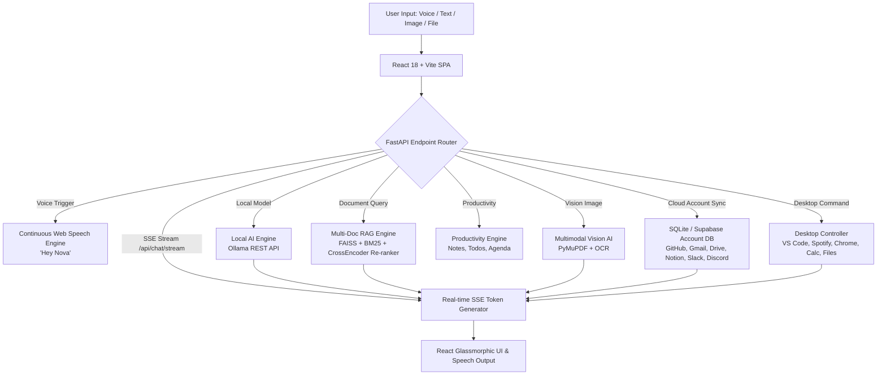

# 🤖 Nova — Autonomous AI Voice & Desktop Intelligence Platform


**Nova** is a production-grade, multi-modal AI Operating System & Autonomous Intelligence Platform built with **React 18, Vite, TailwindCSS, FastAPI, Google Gemini 2.5, FAISS Vector Search, PyMuPDF, and Ollama Local AI**. Nova combines real-time Server-Sent Events (SSE) streaming responses (< 100ms time-to-first-token), continuous hands-free voice command ("Hey Nova" wake-word engine), multi-document RAG, visual multimodal OCR, desktop application launching, cloud suite integrations with database persistence, and system hardware monitoring into a futuristic glassmorphic AI OS interface.

---

## 🌟 Executive Features Overview

| Feature Module | Technology Stack | Key Capabilities |
| :--- | :--- | :--- |
| **🎙️ Continuous Voice Engine** | Web Speech API, Audio Visualizer | Hands-free continuous background listener, "Hey Nova" wake-word detector, animated soundwave visualizer canvas. |
| **⚡ Sub-100ms SSE Streaming** | FastAPI, Server-Sent Events (SSE) | Real-time token-by-token LLM synthesis streaming for instant interactive response. |
| **🧠 Multi-Document RAG** | FAISS, BM25, RRF, CrossEncoder | Hybrid dense-sparse retrieval, reciprocal rank fusion, cached vector embeddings (~0.03ms search). |
| **📸 Vision & Multimodal AI** | Gemini 2.5 Vision, PyMuPDF, OCR | Diagram analysis, screenshot breakdown, optical character recognition, raster image extraction from PDFs. |
| **🖥️ Desktop & OS Controller** | `subprocess`, `psutil`, `pyperclip` | Launches VS Code, Chrome, Spotify, Calculator; searches local files, manages system clipboard, monitors CPU/RAM health. |
| **🔑 Cloud Integrations & DB** | SQLite, Supabase / REST APIs | Interactive account authentication database for Gmail, Google Drive, Calendar, GitHub, Notion, Slack, and Discord. |
| **🎨 Custom Themes & Voice** | React 18, TailwindCSS, Web Speech | Custom UI themes (Cyberpunk Dark, Midnight Blue, Matrix Emerald, Sunset Amber) and Voice Gender / Pitch settings. |
| **📅 Productivity Suite** | SQLite, Thread-safe DB Engine | Saved notes, priority to-do checklists, calendar event scheduler, active reminders, daily planner summary. |
| **🦙 Local AI & Offline Engine**| Ollama REST API (`localhost:11434`) | Offline inference with `llama3`, `mistral`, `phi3`, `gemma`, seamless model switching between online Gemini & offline local models. |
| **📊 Analytics & Diagnostics** | SQLite `query_logs`, `psutil` | Live CPU, RAM, Disk, active top process diagnostic benchmark monitoring & report exporter. |
| **🐳 Production Infrastructure**| Docker, docker-compose, CI/CD | Multi-stage Docker containerization, health checks, GitHub Actions CI/CD workflow (`ci-cd.yml`). |

---

## 🏗️ Architecture Diagram



---

## 🚀 Quickstart Installation & Local Launch

1. **Clone the Repository**:
   ```bash
   git clone https://github.com/Sonal-sp/Nova-An-AI-voice-assistant-.git
   cd Nova-An-AI-voice-assistant-
   ```

2. **Set up Virtual Environment**:
   ```bash
   python -m venv venv
   # On Windows:
   venv\Scripts\activate
   # On Linux/macOS:
   source venv/bin/activate
   ```

3. **Install Python Dependencies**:
   ```bash
   pip install -r requirements.txt
   ```

4. **Install Frontend Dependencies & Build Static Assets**:
   ```bash
   cd frontend
   npm install
   npm run build
   cd ..
   ```

5. **Configure Environment Credentials**:
   Create a `.env` file in the root directory:
   ```env
   GEMINI_API_KEY=your_google_gemini_api_key_here
   ```

6. **Launch Nova Unified Server**:
   ```bash
   python -m uvicorn backend.server:app --port 8000
   ```
   Open your browser at **`http://localhost:8000`**.

---

## 🔮 Future Scope & Engineering Roadmap

Looking forward, Nova is planned to evolve from a multi-modal desktop assistant into a fully autonomous, distributed AI Agent OS:

- [ ] **Multi-Agent Swarm Orchestration**: Autonomous agent delegation (researcher, code builder, data analyst) executing complex multi-step tasks in parallel.
- [ ] **Native OS System Tray & Global Hotkeys**: Electron / Tauri desktop wrapper with global hotkeys (`Alt+Space`) and system tray widget for zero-click access.
- [ ] **WebRTC Realtime Voice-to-Voice Streaming**: Direct low-latency WebRTC audio streaming to Gemini Multimodal Live API for natural conversational interruptions.
- [ ] **Supabase Cloud Synchronization**: Multi-device sync for notes, tasks, custom prompts, and encrypted cloud account tokens.
- [ ] **Mobile Companion App (iOS & Android)**: React Native mobile companion app for remote voice control and real-time desktop notification mirroring.
- [ ] **Custom Tool & Plugin Marketplace**: Plugin SDK enabling developers to write custom sandboxed Python/TypeScript skills and local integrations.

---

## 🧪 Master Verification & Testing

To run the complete production test suite validating all 20 sprints:

```bash
python -m tests.test_master_production_suite
```

---

## 📜 License
Distributed under the MIT License. See `LICENSE` for more information.

---

## Developed By 
**Sonal Shailesh Parmar**  
Computer Engineering | Artificial Intelligence